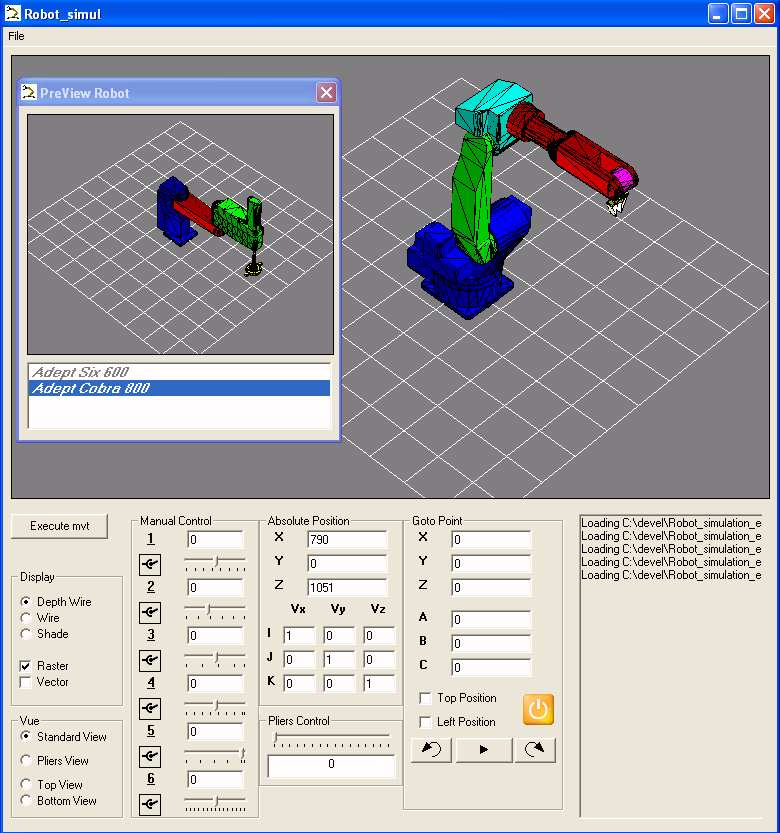



## A 6 axis and 4 axis Scara Robot  Simulator

### Description

Hello,

This source was my first project concerning simulation. So it's an earlier project compare to the 5 axis machine simulator. Comments on this source are quite similar to the previous project :

Most of the code in French. Only tested on NT4, W2000 and XP with an minimum requirement for hardware PIII and OpenGL compatible graphics card.

You will find a copy of the Zip file at : http://5axes.free.fr/devel_robot/robotsimul-en.zip

It's just a prototype whit out any "Commercial" application.

You can load two type of robot : one 6 axis robot (polymorph) and a 4 axis Scara model.

It's possible to move the robot via a direct action on the Join value or it's also possible to give a Goto point . For a robot you have, for the save coordinates several position ( what's why you can find some option boxes for Top and Left position) Depending of the axis limits all this position are not reachable. Just for the Demo you can click on the "execute movement" to have a sample movement. etc...
 
### More Info
 

             |
---                |---
**Submitted On**   |2003-12-23 16:29:16
**By**             |[CUQ](https://github.com/Planet-Source-Code/PSCIndex/blob/master/ByAuthor/cuq.md)
**Level**          |Advanced
**User Rating**    |5.0 (104 globes from 21 users)
**Compatibility**  |VB 6\.0
**Category**       |[Miscellaneous](https://github.com/Planet-Source-Code/PSCIndex/blob/master/ByCategory/miscellaneous__1-1.md)
**World**          |[Visual Basic](https://github.com/Planet-Source-Code/PSCIndex/blob/master/ByWorld/visual-basic.md)
**Archive File**   |[A\_6\_axis\_a1699621262004\.zip](https://github.com/Planet-Source-Code/cuq-a-6-axis-and-4-axis-scara-robot-simulator__1-51247/archive/master.zip)

